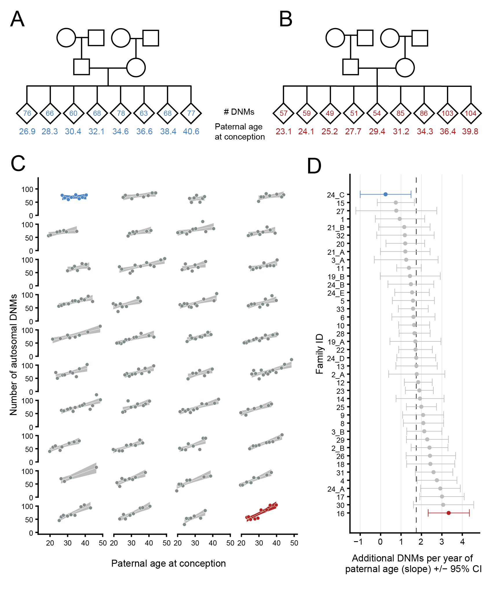

## Large, three-generation CEPH families reveal post-zygotic mosaicism and variability in germline mutation accumulation

### Thomas A. Sasani, Brent S. Pedersen, Ziyue Gao, Lisa M. Baird, Molly Przeworski, Lynn B. Jorde, Aaron R. Quinlan

This repository contains the necessary **Jupyter Notebooks and data files to reproduce figures in the manuscript (also see the link to a Binder environment below)**. 

Below is an example figure from the MS, which summarizes our finding that the paternal age effect on DNM counts significantly differs between CEPH families. This figure can be created (in multiple parts) using this repository.



Two notebooks, `ms_figs.R.ipynb` and `ms_figs.python.ipynb`, can be used to reproduce figures from the manuscript. A notebook called `inter-family-variability.ipynb` can be used to reproduce the statistical analyses associated with inter-family variability in parental age effects. Figures in the manuscript were generated with the versions of each library listed below, though more recent versions (if applicable) will likely work, as well. 

To mitigate compatability/version issues, we have **packaged all notebooks into a [binder](mybinder.org) environment**; to access the environment, **simply click on the badge below**. It might take a minute to load everything.

[](https://mybinder.org/v2/gh/quinlan-lab/ceph-dnm-manuscript/master)

The files included in the `data` directory are organized as follows:

`f1.dnms.txt` and `f2.dnms.txt` contain a row for every DNM identified in the F1 or F2 generation, respectively. `gonosomal.dnms.txt` and `post-pgcs.dnms.txt` contain a row for every DNM identified as being gonosomal or a post-PGCS mosaic mutation, respectively. Each row in these files is formatted like a heavily annotated BED entry, where the first three columns indicate the chromosome, start position, and end position of the variant, followed by additional columns with per-variant information, such as the reference and alternate alleles, depth and genotype qualities in the proband and parents, etc.

For example, the first line of `f1.dnms.txt` is shown below:

```
chrom	start	end	new_sample_id	new_family_id	ref	alt	mut	new_paternal_id	new_maternal_id	kid_ref_depth	kid_alt_depth	kid_total_depth	kid_allele_balance	mom_ref_depth	mom_alt_depthmom_total_depth	dad_ref_depth	dad_alt_depth	dad_total_depth	kid_qual	mom_qual	dad_qual	grandparental_evidence	paternal_age_at_conception	maternal_age_at_conception	phase
1	1088581	1088585	308	19	CTCT	C	indel	293	294	7	11	18	0.611111111111	45	0	45	36	0	36	99.0	99.0	90.0	0	37.5	33.3	46084	paternal
1	1142254	1142255	538	29	G	A	CpG>TpG	544	543	17	15	32	0.46875	24	0	24	35	0	35	99.0	63.0	99.0	0	32.7	27.0	paternal
```

`f1.dnms.summary.csv`, `f2.dnms.summary.csv`, `gonosomal.dnms.summary.csv`, and `post-pgcs.dnms.summary.csv` are summary CSV files, and contain a row for every sample in the F1, F2, F1 (again, but for the gonosomal DNMs), and F2 (again, but for the post-PGCS DNMs) generations, respectively. Each row contains summary information about the sample, including the total number of DNMs identified, the numbers that were phased to either parental allele, the callable autosomal fraction in the sample, etc. 

For example, the first line of `f1.dnms.summary.csv` is shown below:

```
all_dnms,alpha,autosomal_callable_fraction,autosomal_dnms,dad_age,dad_dnms,dad_dnms_auto,dad_dnms_auto_snv,dad_dnms_snv,family_id,maternal_id,mom_age,mom_dnms,mom_dnms_auto,mom_dnms_auto_snv,mom_dnms_snv,n_children,n_sibs,paternal_id,phased_frac,sample_id,snv_autosomal_dnms,snv_dnms
60.0,0.6440677966101694,2587148570.0,60.0,22.8,38.0,38.0,36.0,18.0,20,329,21.6,21.0,21.0,18.0,18.0,9.0,1.0,330,0.9833333333333333,328,55.0,55.0
```

#### Dependencies (if **not** using the Binder environment provided above)

#### For `python 3.6`:

`scipy v1.1.0`

`seaborn v0.9.0`

`matplotlib v2.2.3`

`numpy v1.14.3`

`pandas 0.23.0`

`statsmodels v0.9.0`

#### For `R 3.5.1`:

`ggplot2 v3.1.0`

`cowplot v0.9.3`

#### Installation (if **not** using the Binder environment provided above)

Simply clone the repository and run a notebook as follows:

```
git clone https://github.com/tomsasani/ceph-dnm-manuscript

cd ceph-dnm-manuscript/notebooks

jupyter lab ms_figs.R.ipynb

jupyter lab ms_figs.python.ipynb

jupyter lab inter-family-variability.ipynb
```
